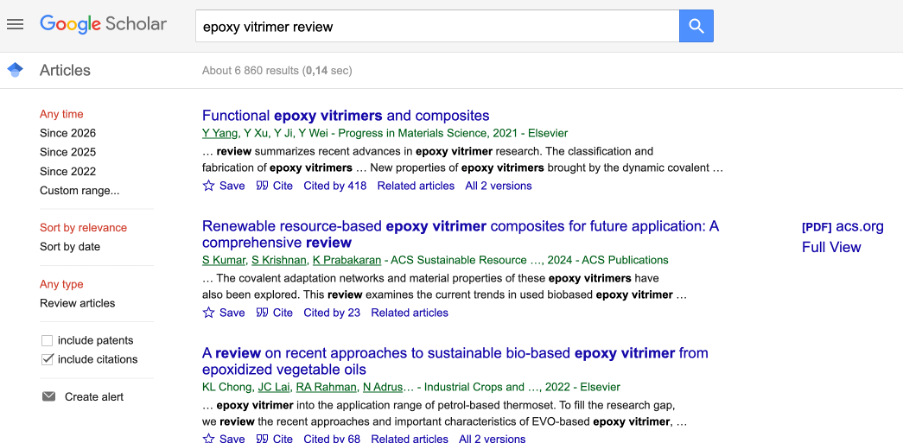
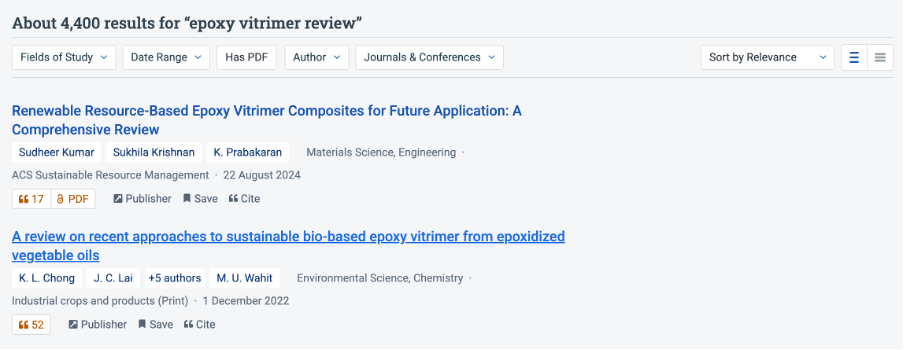
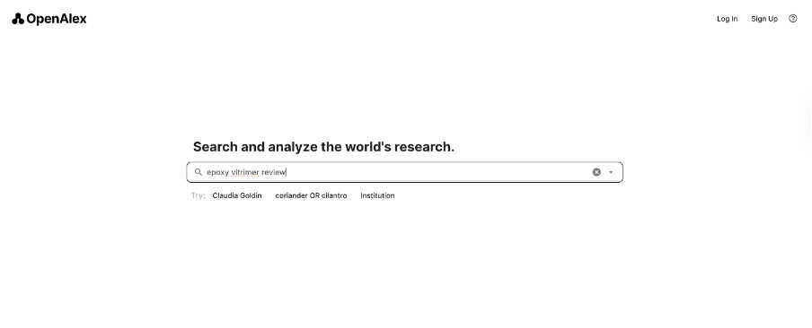
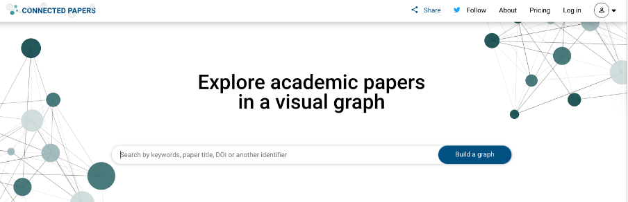
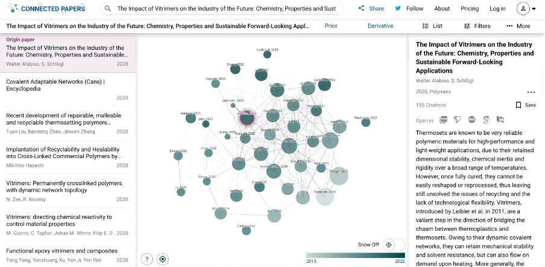
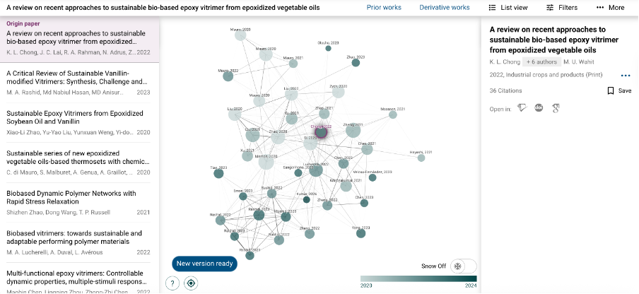
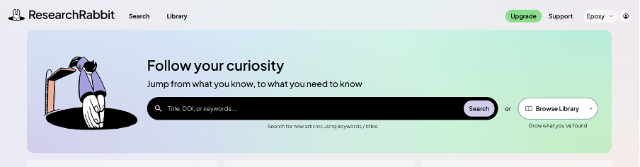
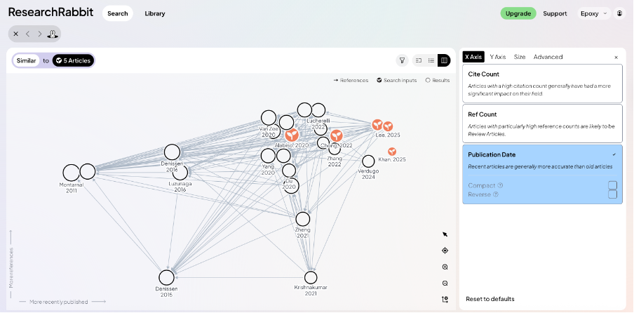
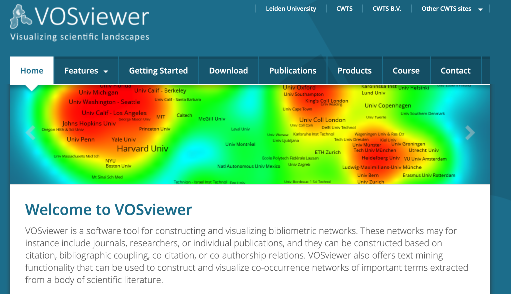
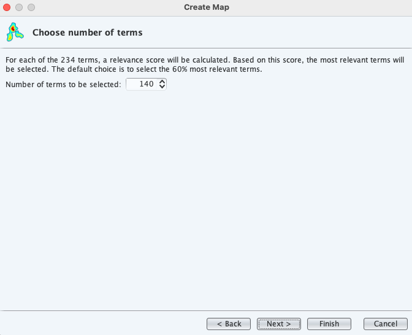

## 1. Motivation

<!-- 近年、科学文献の量は指数関数的に増えており、個々の研究者が手動で読むだけで追跡できる範囲を超えています。しかし同時に、研究分野の発見、マッピング、理解をより効率的にサポートすると主張する幅広い**文献探索ツール**が登場しています。

今回、近年新しく出てきている**現代の文献探索ツールが、研究背景の把握や文献調査においてどの程度有用なのか、*エポキシビトリマー*を具体的な現実的なケーススタディとして使用して、評価を行った。

中心的な質問は：

> *新規分野における研究把握において、現在のツールがどの程度役に立つか。* -->

In recent years, the volume of scientific literature has grown exponentially, exceeding what individual researchers can reasonably track through manual reading alone. At the same time, a wide range of **literature exploration tools** has emerged, claiming to support more efficient discovery, mapping, and understanding of research fields.

This note evaluates **how effective recently emerging modern literature exploration tools are in grasping research backgrounds and conducting literature surveys**, using *epoxy vitrimers* as a concrete and realistic case study.

The central question is:

> *How effective are current tools in helping researchers grasp new fields?*

---

## 2. Scope and Tools Evaluated

<!-- 以下のツールが実践的に評価されました：

- [Google Scholar](https://scholar.google.com/)
- [Semantic Scholar](https://www.semanticscholar.org/)
- [OpenAlex](https://openalex.org/)
- [Connected Papers](https://www.connectedpapers.com/)
- [ResearchRabbit](https://www.researchrabbit.ai/)
- [The Lens](https://www.lens.org/)
- [VOSviewer](https://www.vosviewer.com/)

これらのツールは、**文献計量学**、**科学計量学**、**科学の科学**、および**情報検索**を含む、重複するが異なる研究コミュニティから来てい流ということです。各ツールにはリンクから行けます。 -->

The following tools were evaluated hands-on:

- [Google Scholar](https://scholar.google.com/)
- [Semantic Scholar](https://www.semanticscholar.org/)
- [OpenAlex](https://openalex.org/)
- [Connected Papers](https://www.connectedpapers.com/)
- [ResearchRabbit](https://www.researchrabbit.ai/)
- [The Lens](https://www.lens.org/)
- [VOSviewer](https://www.vosviewer.com/)

These tools originate from overlapping but distinct research communities, including **bibliometrics**, **scientometrics**, **science-of-science**, and **information retrieval**. Each tool is accessible via the provided links.

---

## 3. Google Scholar

<!-- ### 概要
まず最初は、最も広く使われているGoogle Scholarから試しました。Goolge Scholarは最も広く使用されている学術検索エンジンであり、その強みはカバレッジとアクセシビリティにあると思われます。

### 今回行った手順
- `"epoxy vitrimer review"`というキーワードで検索を行った

### 結果
- 数5000件の結果が取得された
- Reviewとキーワードに入れて検索を行ったが、実際にはreview以外の論文も多く含まれているようであった。
- 左のタブにreviewのみを選択するツールがあるのでそれを適用すると約1000件まで結果が減少
- しかしまだ一部Review以外も含まれているように見え、また検索のたびにヒット件数が変化して安定性が疑われた
- また検索結果から重要Reviewを見つけるために、例えばCitationでソートなどをしたかったが、そのような機能は見つからなかった

### 観察
- **エントリーポイント**として優れていると思われる
- しかし体系的なマッピングや再現性には不向きであり
- 検索結果が時折不安定なのが気になった -->

### Overview
First, I tried Google Scholar, the most widely used tool. Google Scholar is the most widely used academic search engine, and its strengths appear to lie in coverage and accessibility.

### Procedure
- Searched with the keyword `"epoxy vitrimer review"`

### Results
- Approximately 5000 results were retrieved.
- Although "review" was included in the keyword, many non-review papers seemed to be included.
- There is a tool in the left tab to select only reviews, which reduced the results to about 1000.
- However, some non-reviews still appeared to be included, and the number of hits varied with each search, raising doubts about stability.
- Additionally, to find important reviews from the results, I wanted to sort by citation, for example, but no such function was found.

<!-- Jekyll/GitHub Pages用 -->
<!--  -->

<!-- Jekyll/GitHub Pages用 -->
<!--  -->

### Observations
- Appears excellent as an **entry point**.
- However, unsuitable for systematic mapping or reproducibility.

---

## 4. Semantic Scholar
<!-- ### 概要
Semantic Scholarは、引用分析、関連性ランキング、論文要約にAIベースの方法を適用するとのこと。

### 手順
- Google Scholarと同じ`"epoxy vitrimer review"`というキーワードで検索を行った

### 結果
- 約4400件の結果がヒット
- しかしここから本当のRreviewのみを抽出するためのフィルター機能などが見つからない

### 観察
- 今回は特にメリットを感じられず -->

<!-- Jekyll/GitHub Pages用 -->
<!--  -->

### Overview
Semantic Scholar applies AI-based methods to citation analysis, relevance ranking, and paper summarization.

### Procedure
- Searched with the keyword `"epoxy vitrimer review"`, same as Google Scholar.

### Results
- Approximately 4400 results were retrieved.
- However, no filter function was found to extract only true reviews from here. 
  
  <!-- Jekyll/GitHub Pages用 -->
  <!--  -->
  
### Observations
- No particular advantages were felt this time.

---

## 5. OpenAlex

<!-- Jekyll/GitHub Pages用 -->
<!--  -->

<!-- ### 概要
OpenAlexは、アレクサンドリア図書館にちなんで名付けられた、オープンアクセスでアクセスできる科学論文、著者、機関の書誌カタログです。2022年1月、OurResearchによって、廃止されたMicrosoft Academic Graphの後継として運用を開始とのこと。詳細は公式Webページ参照

### 手順
- これまでと同じキーワード、`"epoxy vitrimer review"`で検索

### 結果
- 結果が出るまでに少し時間がかかる
- しかし結果が出ると、WorksやStas、TopicやTypeなどあらゆる情報が一発で表示されとても良い
- 今回のキーワードでは30件がヒットし、またさらにTypeでreviewに限定すると、結果は7件となった。

### 観察
- Google Scholarの多量の検索結果に比べて、こちらは7件のみと大きな差が出た。ノイズを少なく欲しい論文のみを見つけるにはこのOpenAlexが良いのかもしれない-->

### Overview
OpenAlex is named after the Library of Alexandria and serves as an open-access bibliographic catalog of scientific papers, authors, and institutions. It commenced operations in January 2022 by OurResearch as a successor to the discontinued Microsoft Academic Graph. For further details, refer to the official website.

### Procedure
- Searched with the same keyword as before: `"epoxy vitrimer review"`

### Results
- It takes some time for results to appear.
- However, once they do, all information such as Works, Stats, Topics, and Types is displayed at once, which is very good.
- For this keyword, 30 hits were obtained, and further restricting to Type=review resulted in 7 results.
  
  
  <!-- Jekyll/GitHub Pages用 -->
  <!--  -->

### Observations
- Compared to Google Scholar's large number of search results, here only 7 were obtained, showing a significant difference. OpenAlex might be suitable for finding desired papers with reduced noise.

---

## 6. Connected Papers

<!-- ### 概要
Connected Papersは、単一のシード論文周辺の**ローカル引用近傍**を可視化してくれるとのこと。
今回はOpenAlexにて得られた論文７報を使って周辺論文の可視化を試み、この分野の全体像を把握できるか評価した。

### 手順
- Connected Papersは複数論文について一括でそれぞれの周辺論文を可視化することはできない
- 先行および派生作品を探索そのため、今回はOpenAlexにてトップにヒットした論文２つをそれぞれ単独で評価した。
- 評価にはトップページにある検索ボックスに、評価したい論文のタイトルもしくはDOIを入れて、Build a graphを押すのみ

### 結果
- 最初の一報については以下のようなグラフが得られた。
- 検索に使用した論文を中心に複数の論文が周りを囲ってネットワークを作っているのがわかる。
- 色が濃い方が新しい論文であり、円の大きさがその分野における重要度の高さを示す模様
- 例えばVitrimerの走りであるLiblerの論文もここにヒットしており、これは集合の少し外側に位置していた。これはコンセプトが少しずつシフトしてきていることを示している。
 
- 次に２報目も使ってグラフを作成した。
- このCOnnected papersは無料アカウントでは１ヶ月に５回までしかグラフを作れないのが難点
- ２報目のグラフは以下のようになった。
- Connected papersは誰が誰を引用したかだけではなく、どの文献文脈に属しているかを可視化するツールとのことで、単純な引用だけでなく、文脈を評価しているとのこと
- そしてこの２報目においてはLiblerの名前は出てこなかった。
- 今回この２報目はバイオ由来材料を用いてVitrimerを作成することに関する総説であり、すでにここに一分野ができてきていることを示している。

### 観察
- 特定の周辺を知りたい論文がある場合は有用だと思う。
- 例えば自分の論文の周辺状況の確認や過去の論文の今の周辺状況の確認など
- しかし今回の目的はEpoxy vitrimerの全体像の把握であり、その場合一方づつ確認するこのコンセプトは適さない。-->

  
  <!-- Jekyll/GitHub Pages用 -->
  <!--  -->
### Overview
Connected Papers visualizes the **local citation neighborhood** around a single seed paper.
This time, using the 7 papers obtained from OpenAlex, I attempted to visualize surrounding papers to evaluate whether the overall picture of this field could be grasped.

### Procedure
- Connected Papers cannot visualize surrounding papers for multiple papers in bulk at once.
- To explore prior and derivative works, this time, I evaluated two papers that hit the top in OpenAlex individually.
- For evaluation, simply enter the title or DOI of the paper to be evaluated in the search box on the top page and click "Build a graph".

### Results
- For the first paper, a graph like the following was obtained.
  
  
<!-- Jekyll/GitHub Pages用 -->
<!--  -->

- It can be seen that multiple papers form a network surrounding the searched paper at the center.
- Darker colors indicate newer papers, and the size of the circles seems to indicate the importance in the field.
- For example, Leibler's paper, which is the pioneer of vitrimers, also hit here, and it was located slightly outside the cluster. This indicates that the concept has been shifting gradually.
 
- Next, I created a graph using the second paper as well.
- A drawback is that Connected Papers allows only 5 graph creations per month for free accounts.
- The graph for the second paper looked like the following.
  
    
  <!-- Jekyll/GitHub Pages用 -->
  <!--  -->

- Connected Papers is a tool that visualizes not only who cites whom, but also which literature context it belongs to, and it is said to evaluate not just simple citations but context.
- In this second paper, Leibler's name did not appear.
- This second paper is a review on creating vitrimers using bio-derived materials, indicating that a subfield has already formed here.

### Observations
- It seems useful when you want to know the specific surroundings of a particular paper.
- For example, checking the surrounding situation of one's own paper or the current surroundings of past papers.
- However, the purpose this time is to grasp the overall picture of epoxy vitrimers, and in that case, this concept of checking one by one is not suitable.

---

## 7. ResearchRabbit

<!-- ### 概要
Connected papersは一本の論文から深く探索するツールであったが、似たようなコンセプトではあるが、ResearchRabbitは、反復的な探索を通じて**類似および関連論文**の発見に焦点を当てていいるとのことで、複数論文を一括で入力して分野の広がりや、分野の分化を見ることができるツールとのこと。

### 手順
- アカウントを作成
- Collectionというものを作成
- OpenAlexで得られた総説７法を全て入力（DOIやタイトル検索で簡単に入力できた）
- ７報中２報はRabbit中で見つけることができなかった。データベスの違いからか？
- 入力集合ができたら”Similar Works”をクリック

### 結果
- 以下のようなグラフが出力された
- 関連論文は合計2000件見つかり、その中の”関連度”（この関連度というのが難しい、単純なCitationではもちろんない。Rabbit独自の検索概念によるもの）の高いものから順に２０件ずつをマップにして表示してくれる
- グラフは公開年とCitation数などを軸にマップ化されている。このコネクションによってどの論文がどの論文を引用しているかがわかる
- 一方例えば今回の刑では一方、検索に入れた論文に一つもコネクションが表示されないものがあった。これはもちろん総説なので総説ないで引用している論文は多数あるはずであり、Similar論文も多くあるはずであるが、このRabbitの評価において、この５報の総説を総括して分野の中心文脈を評価した結果、それらは文脈を代表する類似度ではないため、初期の２０件には表れていないのだろうと思われた。しかしそれを確認するためには2000件を20件ずつ見ていくか、2000件のリストを見る必要があり、分野の中心や文化を評価するには不適と思われた。

### 観察
- Research Rabbitは“discover papers you might not have found otherwise”を目的に設計されていると明言しているようで、確かに特定の論文から新しい文献を発見するにはよいツールなのかもしれない。
- しかし、それらの見つかった論文群のセグメンテーションを行うためのツールではないと思われた -->

<!-- Jekyll/GitHub Pages用 -->
<!--  -->
### Overview
While Connected Papers was a tool for deep exploration from a single paper, ResearchRabbit, although similar in concept, focuses on discovering **similar and related papers** through iterative exploration, and it is said to be a tool that can input multiple papers at once to see the expansion and differentiation of the field.

### Procedure
- Created an account.
- Created a Collection.
- Input all 7 reviews obtained from OpenAlex (easy to input via DOI or title search).
- Out of 7, 2 could not be found in Rabbit. Due to database differences?
- Once the input set was ready, clicked "Similar Works".

### Results
- A graph like the following was output.
  
  
  <!-- Jekyll/GitHub Pages用 -->
  <!--  -->

- A total of 2000 related papers were found, and from among them, the ones with high "relevance" (this relevance is difficult; of course not simple citation, but based on Rabbit's unique search concept) are displayed in a map 20 at a time in order.
- The graph is mapped with axes such as publication year and citation count. Through this connection, it can be seen which papers cite which papers.
- On the other hand, for example, in this case, there were some papers entered in the search that had no connections displayed at all. Of course, since they are reviews, there should be many papers cited within the reviews, and there should be many similar papers as well, but in Rabbit's evaluation, as a result of comprehensively evaluating the central context of the field based on these 5 reviews, they were not representative of similarity, so they did not appear in the initial 20. To confirm that, it would be necessary to look through 2000 papers 20 at a time or view the list of 2000, which seemed unsuitable for evaluating the center or culture of the field.

### Observations
- ResearchRabbit seems to be designed with the purpose of "discover papers you might not have found otherwise," and indeed, it might be a good tool for discovering new literature from specific papers.
- However, it did not seem to be a tool for segmenting the found groups of papers.

---
## 8. VOSviewer

<!-- ### 概要
VOSviewerは、**共起とネットワーク構造**に焦点を当てた文献計量可視化ツールとのこと。これは基本的にはViewerだが、使用中に分かったが、すでにOpenAlexとのAPIによる連携があり、VOS Viewerのみで検索からマップ作成まで一括で行ける。

### 手順
- VOSViewerをWebからインストール
- MacではJavaの不具合により最新のJavaを入れていてもappのダブルクリックからはひらかない
- 開くためには、Terminalから、cd /Applications/VOSviewer.app/Contents/Java
java -jar VOSviewer.jar
と入力して起動する。

- 開いたらOpenAlexAPIにより直接検索。
- Or検索はできないので、今回は単純に”Epoxy Vtrimer”で検索
- 約270件の論文がヒット
そしてここからが大切、今回は以下の条件で作図した
- Bnary counting
- Minimum Occurrence：5
- Number of terms：140

まず、
•	Occurrenceとは、
→ 「何本の論文にその語が出てきたか」
•	Relevanceとは
→ 「その語が、この分野にどれだけ“特徴的”か」
　（＝一般語ではなく、この分野らしいか）
この2つは 別物で、大小関係が逆転することも普通とのこと。
Occurrence（出現数）とは何か
定義（VOSviewerの意味）
そのキーワードが、
何本の文献に少なくとも1回出てきたか
あなたは Binary counting を選んでいるので：
•	1本の論文に
o	thermal stability が
	1回出ても
	20回出ても
→ Occurrence = 1
具体例
•	epoxidized soybean oil
o	Occurrence = 7
→ 7本の論文が触れている
•	carbon fiber composite
o	Occurrence = 11
→ 比較的よく出る用途語
👉
Occurrence = 普及度（論文数ベース）
 
② Relevance（関連度）とは何か
定義（公式の考え方）
VOSviewer の Relevance は：
「その語が、
他分野でも普通に出てくる語か、
それともこの分野に特有の語か」
を数理的に評価した指標。
直感的には
•	高 Relevance
→ この分野っぽい語
•	低 Relevance
→ どこにでも出る一般語
具体例（あなたの画面）
•	sustainable epoxy vitrimer
o	Relevance ≈ 3.8
→ 分野特有語
•	thermoplastic
o	Relevance ≈ 1.5
→ 他分野でも普通に出る
👉
Relevance = 分野らしさ
を示している。

### 結果
- 今回の条件で得られた結果が以下の通り
  
- 色は各分野のクラスターを表示、かく円の大きさが頻度を示し、繋ぐリンクの線がどのようなキーワードが同時に出てきているかを示している
- 今回の目的である分野の全体像を把握するにはとてもあっている
- 例えば今回私はEpoxy vitrimersの耐熱性用途が、Epoxy Vitrimer分野全体においてどういう位置付けにあるのかを知りたかったが、これによってこの分野はメインではなく、右下赤色で示される部分であることがわかり、他にもコンポジットやおそらくバイオ系の用途の分野にもEpoxy vitrimersは広がっていることがわかる。今回はまだ行なっていないが、このクラスターに分類される論文を改めてここから抽出することもできるのではないか。（後記、調べたけどVOSViewer単体ではできないみたい。これを行うにはOpenAlexを使って、今回のキーワードEpoxy vitrimersとクラスターに含まれるキーワード、Thermal stabilityなどを組み合わせて検索するのが良さそう）
 
- この得られたグラフは写真として保存できるし、RawデータとしてVOSも保存できる。しかしこのMacのVersionではなぜかVOS保存ができないので、代替としてJsonを使用。VSOよりもJsonの方が上位互換の模様で何も問題ない。
- しかし注意しなければならないのは、結果には作図における条件が含まれていないこと。後日もう一度同じ図を得るには条件を別途保存しておかないと再現性がなくなるので注意が必要。いかが必要再現条件
•	OpenAlexの検索クエリ
•	検索日時
•	ヒット総件数（例：800件）
•	文献タイプ（article / review）
•	VOSviewerの解析条件
o	Binary / Full counting
o	Minimum occurrence = 5
o	relevance cut = 60%
o	clustering resolution

- またViewerでは距離として可視的にのみ表示されるが、保存したJson結果をPythonで処理すれば各キーワードの距離とクラスターの種類を一発でテーブルにすることができ、距離を数値化できる。（VOSviewer_json_exporter.py）
- いかがcsv化したテーブルイメージ。これは他の結果と客観比較するのに便利

### 観察
- **フィールドレベルの構造**に最適なツール
- パラメータの慎重な解釈と記録が重要 -->

<!-- Jekyll/GitHub Pages用 -->
<!--  -->

### Overview
VOSviewer is a bibliometric visualization tool focusing on **co-occurrence and network structure**. It is essentially a viewer, but during use, I discovered that it already has API integration with OpenAlex, allowing search to map creation to be performed entirely within VOSviewer.

### Procedure
- Installed VOSviewer from the web.
- On Mac, due to Java issues, even with the latest Java installed, it does not open from double-clicking the app.
- To open it, launch from Terminal with: cd /Applications/VOSviewer.app/Contents/Java; java -jar VOSviewer.jar.

- Once opened, searched directly via OpenAlex API.
- OR search is not possible, so this time searched simply with "Epoxy Vitrimers".
- Approximately 270 papers were retrieved.
- From here, the important part: this time, visualization was created under the following conditions:
  - Binary counting
  - Minimum Occurrence: 5
  - Number of terms: 140
  
  
  <!-- Jekyll/GitHub Pages用 -->
  <!--  -->
  
### Understanding of VOSviewer
Occurrence means → "How many papers the term appeared in". 

Relevance means → "How 'characteristic' the term is to this field" (= whether it is a general term or specific to this field). 

These two are different things, and it is common for their magnitudes to reverse.

1. What is Occurrence (occurrence count)?

    Definition (VOSviewer's meaning):
    The number of documents in which the keyword appeared at least once.

    Since Binary counting was selected:

    In one paper, thermal stability appears 1 time or 20 times → Occurrence = 1

    Specific example
    - epoxidized soybean oil
      - Occurrence = 7
        - 7 papers mention it
    - carbon fiber composite
      - Occurrence = 11
        - Relatively common application term

    👉 Occurrence = Popularity (based on number of papers)

2. What is Relevance (relevance)?

    Definition (official thinking)
    VOSviewer's Relevance is:
    A mathematically evaluated indicator of whether the term is commonly used in other fields or specific to this field.

    Intuitively,
    - High Relevance → Term specific to this field
    - Low Relevance → General term that appears anywhere
    
    Specific example (your screen)
    - sustainable epoxy vitrimer
      - Relevance ≈ 3.8 → Field-specific term
    - thermoplastic
      - Relevance ≈ 1.5 → Commonly used in other fields
  
    👉
    Relevance = Field-likeness

### Results
- The results obtained under these conditions are as follows.

<!-- Jekyll/GitHub Pages用 -->
<!--  -->

- Colors represent clusters of each field, the size of each circle indicates frequency, and the connecting lines show which keywords appear simultaneously.
- It is very suitable for grasping the overall picture of the field, which is the purpose this time.
- For example, I wanted to know how the thermal applications of Epoxy vitrimers are positioned within the entire Epoxy Vitrimers field, and this showed that this field is not the main one, but the part shown in red in the bottom right, and that Epoxy vitrimers are also expanding into fields such as composites and probably bio-based applications. Although not done this time, it might be possible to extract papers classified into this cluster from here again. (Postscript: I checked, but it seems not possible with VOSviewer alone. To do this, it seems good to use OpenAlex to search by combining the keyword Epoxy vitrimers with keywords included in the cluster, such as Thermal stability.)

- This obtained graph can be saved as a photo, and raw data as VOS. However, in this Mac version, VOS saving does not work for some reason, so use JSON as an alternative. JSON seems to be upward compatible with VOS and no problem.
- However, it is important to note that the results do not include the conditions for visualization. To obtain the same figure again later, reproducibility is lost unless the conditions are saved separately, so be careful. Necessary reproducibility conditions:
  - OpenAlex search query
  - Search date and time
  - Total hits (e.g., 800)
  - Document type (article / review)
  - VOSviewer's analysis conditions
    - Binary / Full counting
    - Minimum occurrence = 5
    - relevance cut = 60%
    - clustering resolution

- Also, in the viewer, distances are displayed only visually, but by processing the saved JSON results with Python, the distance and type of cluster for each keyword can be tabulated at once, allowing numerical quantification of distances. (VOSviewer_json_exporter.py)
  
- Here is the image of the table after CSV conversion. 

<!-- Jekyll/GitHub Pages用 -->
<!--  -->
This is convenient for objective comparison with other results.

### Observations
- Best tool for **field-level structure**
- Careful interpretation and recording of parameters are important
---

## 9. The Lens

<!-- ### 概要
最後にThe Lensを試した。これはは、**学術文献と特許**を単一のプラットフォームに統合してくれるツールとのこと。今回私はEpoxy vitrimersの実際の産業への応用状況に興味があるのでこのツールは興味深い

### 手順
- トップページから、特許検索: `(epoxy AND vitrimer)`をおこなのみ、とても使いやすい
- 必要に応じて特許のステータスによるフィルターなども可能

### 結果
- 今回の検索でやく500件の特許が見つかった。
- インターフェースがとてもよく、誰が出願しているのか、プレーヤーや出願年代、特許ステータスも一発で分かる。とても良い。
  
- 今回はここからさらに耐熱用途を絞りたかったので、検索にHeat resistance or Heat resistantをandで追加。結果、約160件に絞られた。この数の減少度からも、このキーワードの特許における重要度を測ることができる。すなわち約3分の1の特許がこのキーワードについて議論しているということ。VOSviewerにおいては学術論文を同様に評価したが、耐熱に関するキーワードは約170件中の10-17位程度。今のところこのキーワードにおいては学術と産業で重要度に大きな乖離はないことが分かる。

### 観察
- **科学–技術のリンク**における独自の強み
- アプリケーション指向の分析に不可欠、またとても使いやすい、おすすめ -->

### Overview
Finally, I tried The Lens. It is a tool that integrates **academic literature and patents** into a single platform. Since I am interested in the actual industrial application status of Epoxy vitrimers, this tool is interesting.

### Procedure
- From the top page, perform patent search: `(epoxy AND vitrimer)` only, very easy to use.
- If necessary, filtering by patent status is also possible.
 
  
<!-- Jekyll/GitHub Pages用 -->
<!--  -->

### Results
- In this search, approximately 500 patents were found.  

  
<!-- Jekyll/GitHub Pages用 -->
<!--  -->

- The interface is very good, and it is possible to see at a glance who is applying, players, filing years, patent status. Very good.

- This time, I wanted to narrow down to thermal applications, so I added "Heat resistance" or "Heat resistant" to the search with AND. As a result, it was narrowed down to about 160. From the degree of this number reduction, the importance of this keyword in patents can be measured. That is, about 1/3 of the patents discuss this keyword. In VOSviewer, academic papers were evaluated similarly, but thermal-related keywords were about 10-17th out of about 170. For now, there is no significant divergence in importance between academia and industry for this keyword.

<!-- Jekyll/GitHub Pages用 -->
<!--  -->
### Observations
- Unique strength in **science–technology linkage**
- Essential for application-oriented analysis, also very easy to use, recommended

---

## 10. Reflections

<!-- 結論、今の所VOS Viewer内でのAPIを使ったOpenAlexによる検索と、VOSviewerによる可視化が最も効果的に全体像を把握するのには適していると感じた。またLensも特許のステータスや出願国、年代まで一発でまとめてくれてとても有用であると感じた。同様の手法を取れば新規分野においても大まかに現状把握が可能になると思われる。 -->

In conclusion, so far, I feel that searching using OpenAlex via API within VOS Viewer and visualization with VOS Viewer are most effective for grasping the overall picture. I also felt that Lens is very useful as it summarizes patent status, filing countries, and eras all at once.

